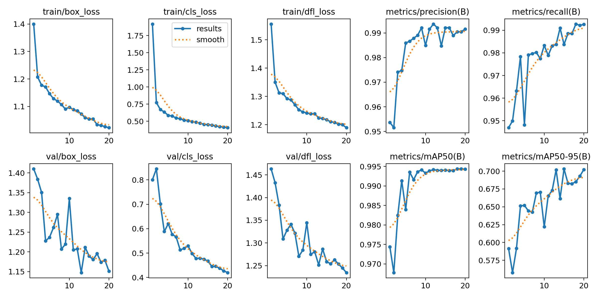
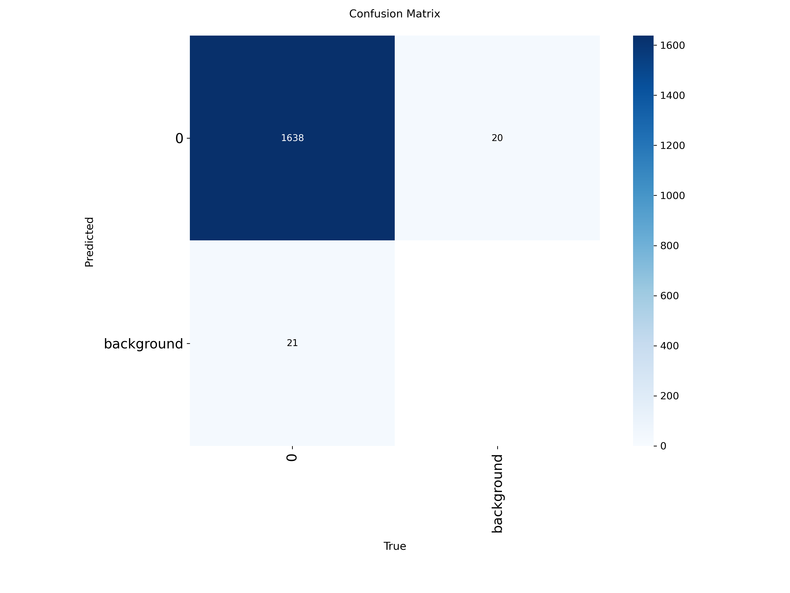
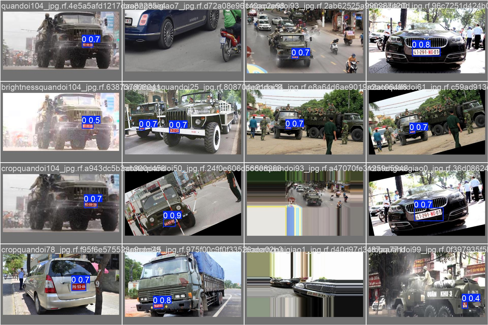

# 🚗 Automatic License Plate Recognition (ALPR) System

**End-to-end computer vision system for real-time vehicle detection, tracking, and license plate recognition.**

[](https://python.org)
[](https://pytorch.org)
[](https://github.com/ultralytics/ultralytics)

---

## 📋 Overview

This project implements a complete ALPR pipeline combining state-of-the-art deep learning models with classical computer vision techniques. The system can process video streams to detect vehicles, track them across frames, count line crossings, detect license plates, and perform OCR.

**Key Features:**
- ✅ Multi-class vehicle detection (cars, motorcycles, buses, trucks)
- ✅ Real-time object tracking with SORT algorithm
- ✅ Line crossing counter for traffic monitoring
- ✅ High-accuracy license plate detection (**99.43% mAP@0.5**)
- ✅ OCR with Vietnamese character support
- ✅ FastAPI REST API for production deployment
- ✅ Docker support

---

## 🏗️ Architecture

```
Input Video → Vehicle Detection → Tracking → Counting → Plate Detection → OCR → Output
     ↓              (YOLOv8)         (SORT)    (Line)      (YOLOv8)      (EasyOCR)    ↓
   Frame                                                                           Annotations
```

**Pipeline Components:**
1. **Vehicle Detector:** YOLOv8n pretrained on COCO (cars, motorcycles, buses, trucks)
2. **Tracker:** SORT (Simple Online Realtime Tracker)
3. **Line Counter:** Geometric line crossing detection
4. **Plate Detector:** YOLOv8n fine-tuned on license plate dataset
5. **OCR:** EasyOCR with Vietnamese language support

---

## 📊 Performance Metrics

### Plate Detection Model (YOLOv8n)
| Metric | Value |
|--------|-------|
| **mAP@0.5** | **99.43%** |
| **mAP@0.5:0.95** | 73.67% |
| **Precision** | 99.4% |
| **Recall** | 98.5% |
| **Inference Speed** | 2.6ms/image (GPU) |
| **Model Size** | 6.3 MB |
| **Training Time** | 49.2 min (Tesla T4) |

**vs. Baseline FasterRCNN-MobileNetV3:**
- mAP@0.5: 99.43% vs 72.0% (**+27.4%** ↑)
- Speed: 2.6ms vs 45ms (**17x faster** ↑)

### Full Pipeline
- Processing Speed: **3.3 FPS** (1920x1080, Tesla T4)
- Vehicle Detection: ✅ Robust
- Tracking: ✅ Stable
- Plate Detection: ⚠️ Requires horizontal camera angle for best results

---

## 🚀 Quick Start

### Installation

```bash
# Clone repository
git clone https://github.com/nguyencongtuyenlp/license-plate-recognition.git
cd license-plate-recognition

# Install dependencies
pip install -r requirements.txt

# Download dataset (optional, for training)
python scripts/download_dataset.py
```

### Demo Inference

**1. Single Image:**
```bash
python demo.py --image test.jpg --output result.jpg
```

**2. Video Processing:**
```bash
python demo.py --video input.mp4 --output detected.mp4 --device cuda
```

**3. Webcam (Real-time):**
```bash
python demo.py --webcam
```

**4. Full ALPR Pipeline:**
```bash
python demo_full_pipeline.py \
  --video traffic.mp4 \
  --output annotated.mp4 \
  --device cuda
```

---

## 🔬 Training

### Train YOLOv8 Plate Detector

```bash
python -m src train \
  --model yolo \
  --config configs/train_yolo.yaml \
  --device cuda
```

**Configuration:** `configs/train_yolo.yaml`
- Epochs: 50
- Image size: 640
- Batch size: 16
- Optimizer: Auto (SGD with warmup)
- Augmentation: Mosaic, MixUp disabled for plates

### Hyperparameters

```yaml
lr0: 0.01              # Initial learning rate
momentum: 0.937        # SGD momentum
weight_decay: 0.0005   # L2 regularization
warmup_epochs: 3       # Linear warmup
cos_lr: True           # Cosine annealing
```

---

## 📁 Project Structure

```
license-plate-recognition/
├── src/
│   ├── data/           # Dataset loaders, augmentation
│   ├── models/         # Detection models (YOLOv8, FasterRCNN)
│   ├── training/       # Training loops, evaluators
│   ├── tracking/       # SORT tracker
│   ├── counting/       # Line crossing counter
│   ├── ocr/            # License plate OCR
│   ├── inference/      # Full ALPR pipeline
│   └── api/            # FastAPI server
├── configs/            # Training & inference configs
├── scripts/            # Utility scripts
├── notebooks/          # Jupyter notebooks
├── training_artifacts/ # Trained models & logs
├── demo.py             # Simple plate detection demo
├── demo_full_pipeline.py  # Full ALPR demo
└── requirements.txt
```

---

## 🎓 Technical Highlights

### Custom Implementations

**1. Attention Mechanisms (`src/models/attention.py`)**
- CBAM (Convolutional Block Attention Module)
- SE (Squeeze-and-Excitation) blocks

**2. Data Augmentation (`src/data/augmentation.py`)**
- Mosaic augmentation
- MixUp
- CutOut

**3. YOLO Dataset Converter (`src/data/yolo_dataset.py`)**
- COCO → YOLO format conversion
- Automatic data.yaml generation

### Design Patterns
- **Composition over Inheritance:** Modular pipeline design
- **Factory Pattern:** Dynamic model loading
- **Strategy Pattern:** Swappable OCR engines

---

## 📸 Demo Results

### Training Curves


### Confusion Matrix


### Predictions


---

## 🔧 API Usage

### Start Server

```bash
python -m src api --host 0.0.0.0 --port 8000
```

### API Endpoints

**Process Single Frame:**
```bash
curl -X POST "http://localhost:8000/process_frame" \
  -F "image=@frame.jpg"
```

**Process Video:**
```bash
curl -X POST "http://localhost:8000/process_video" \
  -F "video=@traffic.mp4"
```

---

## 🐳 Docker Deployment

```bash
# Build image
docker build -t alpr-system .

# Run container
docker run -p 8000:8000 --gpus all alpr-system
```

---

## ⚠️ Limitations & Future Work

### Current Limitations
1. **Camera Angle Sensitivity:** Best performance with horizontal/diagonal angles. Top-down views reduce plate detection accuracy.
2. **Real-time Performance:** 3.3 FPS on Tesla T4. Requires optimization for 30+ FPS.
3. **OCR Accuracy:** Depends on image quality and lighting conditions.

### Roadmap
- [ ] TensorRT optimization for real-time inference (25-30 FPS target)
- [ ] Camera angle augmentation during training
- [ ] Polygon counting zones (vs. simple lines)
- [ ] Multi-language OCR support
- [ ] Database integration for plate logging
- [ ] Web dashboard for monitoring

---

## 📚 References

- **YOLOv8:** [Ultralytics](https://github.com/ultralytics/ultralytics)
- **SORT:** [Simple Online Realtime Tracking](https://github.com/abewley/sort)
- **EasyOCR:** [JaidedAI](https://github.com/JaidedAI/EasyOCR)
- **Dataset:** [Roboflow License Plates](https://universe.roboflow.com/roboflow-universe-projects/license-plate-recognition-rxg4e)

---

## 📄 License

MIT License - See [LICENSE](LICENSE) for details.

---

## 👤 Author

**Nguyen Cong Tuyen**  
📧 nguyencongtuyenlp@gmail.com  
🔗 [GitHub](https://github.com/nguyencongtuyenlp)

---

## 🙏 Acknowledgments

- Roboflow for dataset hosting
- Ultralytics for YOLOv8 framework
- Lightning.ai for free GPU compute
