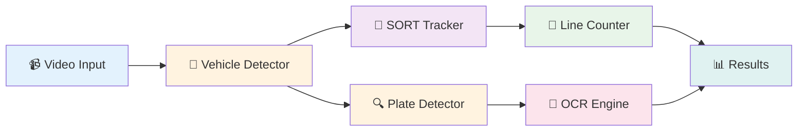

<div align="center">

# 🚗 License Plate Recognition System

**End-to-End Deep Learning Pipeline for Vehicle Tracking & ALPR**

[](https://www.python.org/)
[](https://pytorch.org/)
[](https://fastapi.tiangolo.com/)
[](LICENSE)
[](https://github.com/psf/black)

**[Features](#-features) • [Quick Start](#-quick-start) • [Architecture](#-architecture) • [Training](#-training) • [API](#-api-server) • [Skills](#-technical-skills-demonstrated)**


---

</div>

## 📋 Overview

A production-ready **Automatic License Plate Recognition (ALPR)** system that demonstrates advanced AI engineering skills through custom PyTorch implementations. This project showcases real-world deep learning expertise beyond typical high-level frameworks.

### 🎯 What Makes This Special?

- **Custom Training Loop** — Hand-coded PyTorch training with AMP, gradient clipping, and cosine annealing
- **Advanced Algorithms** — SORT tracker (Kalman Filter + Hungarian), DFS/BFS graph algorithms, spatial hierarchies
- **Professional Engineering** — OOP design patterns (ABC, Factory, Singleton, Composition)
- **Full-Stack ML** — From data loading to REST API deployment
- **Portfolio-Ready** — Clean code, comprehensive documentation, production mindset

---

## ✨ Features

<table>
<tr>
<td width="50%">

### 🔍 Detection & Recognition
- **Vehicle Detection** using pretrained FasterRCNN
- **License Plate Detection** with custom-trained model
- **OCR** with EasyOCR + regex postprocessing
- **Multi-class support** ready for expansion

</td>
<td width="50%">

### 📊 Tracking & Counting
- **SORT Tracker** (Kalman Filter + Hungarian Algorithm)
- **Line-crossing counter** with cross product math
- **Re-identification** using BFS shortest path
- **Trajectory reconstruction** with DFS

</td>
</tr>
<tr>
<td width="50%">

### 🧠 Advanced Algorithms
- **Graph Theory:** DFS trajectory tracking, BFS re-ID
- **Linear Algebra:** IoU computation, bbox transforms
- **Probability:** Kalman Filter state estimation
- **Optimization:** Hungarian assignment algorithm

</td>
<td width="50%">

### 🚀 Production Features
- **FastAPI REST API** for easy integration
- **Docker support** for containerized deployment
- **Config management** with YAML + Singleton pattern
- **Dual logging** (TensorBoard + CSV)

</td>
</tr>
</table>

---

## 🏗️ Architecture



**Pipeline Flow:**
1. **Vehicle Detection** → FasterRCNN (COCO pretrained)
2. **Tracking** → SORT (Kalman Filter + Hungarian matching)
3. **Counting** → Cross product line-crossing detection
4. **Plate Detection** → Custom FasterRCNN-MobileNetV3
5. **OCR** → EasyOCR + Vietnamese regex validation
6. **Output** → JSON results via FastAPI

---

## 🚀 Quick Start

### 📦 Installation

```bash
# Clone the repository
git clone https://github.com/nguyencongtuyenlp/license-plate-recognition.git
cd license-plate-recognition

# Install dependencies
pip install -r requirements.txt
```

### 📥 Download Dataset

**Option 1: Automatic (Recommended)**
```bash
python scripts/download_dataset.py --format coco --output data
```

**Option 2: Manual**
1. Visit [Roboflow Dataset](https://universe.roboflow.com/nguyn-cng-tuyn/my-first-project-usuhh-7gecz)
2. Download COCO format (version 2)
3. Extract to `data/coco/`

**Dataset Specs:**
- 📊 **Total:** 8,255 images
- 🎯 **Classes:** 1 (license_plate)
- 📏 **Split:** Train (5,756) | Val (1,640) | Test (859)
- 📝 **Format:** COCO JSON

### 🎓 Training

```bash
# Basic training
python -m src train --config configs/train_plate_detector.yaml

# Custom settings
python -m src train \
  --config configs/train_plate_detector.yaml \
  --epochs 50 \
  --batch-size 8 \
  --device cuda
```

### 🔮 Inference

```bash
# Process video
python -m src infer \
  --video input.mp4 \
  --output output.mp4 \
  --device cuda

# Evaluate model
python -m src evaluate \
  --checkpoint checkpoints/best.pth \
  --config configs/train_plate_detector.yaml
```

### 🌐 API Server

```bash
# Start server
python -m src api --host 0.0.0.0 --port 8000

# Test endpoint
curl -X POST http://localhost:8000/infer_video \
  -F "file=@test_video.mp4"
```

**API Docs:** http://localhost:8000/docs (auto-generated Swagger UI)

---

## 🧠 Technical Skills Demonstrated

<table>
<thead>
<tr>
<th width="20%">Category</th>
<th width="30%">Skill</th>
<th width="30%">Implementation</th>
<th width="20%">File</th>
</tr>
</thead>
<tbody>

<tr>
<td rowspan="4"><b>🔷 Deep Learning</b></td>
<td>Custom Training Loop</td>
<td>AMP, gradient clipping, warmup</td>
<td><code>training/trainer.py</code></td>
</tr>
<tr>
<td>Transfer Learning</td>
<td>FasterRCNN fine-tuning</td>
<td><code>models/plate_detector.py</code></td>
</tr>
<tr>
<td>Evaluation Metrics</td>
<td>Hand-coded mAP, IoU, PR curves</td>
<td><code>training/metrics.py</code></td>
</tr>
<tr>
<td>Data Augmentation</td>
<td>Custom transform pipeline</td>
<td><code>data/transforms.py</code></td>
</tr>

<tr>
<td rowspan="3"><b>📊 Algorithms</b></td>
<td>Graph Traversal (DFS)</td>
<td>Trajectory reconstruction, ROI tree</td>
<td><code>tracking/track_graph.py</code></td>
</tr>
<tr>
<td>Graph Traversal (BFS)</td>
<td>Re-ID shortest path, NMS clustering</td>
<td><code>tracking/associator.py</code></td>
</tr>
<tr>
<td>Kalman Filter</td>
<td>7D state estimation for tracking</td>
<td><code>tracking/sort_tracker.py</code></td>
</tr>

<tr>
<td rowspan="4"><b>🏛️ Design Patterns</b></td>
<td>Abstract Base Class</td>
<td>Detector interface</td>
<td><code>models/base_detector.py</code></td>
</tr>
<tr>
<td>Factory Pattern</td>
<td>Detector creation by name</td>
<td><code>models/base_detector.py</code></td>
</tr>
<tr>
<td>Singleton Pattern</td>
<td>Config manager</td>
<td><code>utils/config.py</code></td>
</tr>
<tr>
<td>Composition</td>
<td>Pipeline architecture</td>
<td><code>inference/pipeline.py</code></td>
</tr>

<tr>
<td rowspan="2"><b>🔧 Engineering</b></td>
<td>REST API</td>
<td>FastAPI with async/await</td>
<td><code>api/app.py</code></td>
</tr>
<tr>
<td>Logging & Monitoring</td>
<td>TensorBoard + CSV dual logging</td>
<td><code>utils/logger.py</code></td>
</tr>

</tbody>
</table>

---

## 📊 Training Details

### 🎛️ Hyperparameters

| Parameter | Value | Notes |
|-----------|-------|-------|
| **Model** | FasterRCNN-MobileNetV3-FPN | Lightweight backbone |
| **Optimizer** | SGD | momentum=0.9, weight_decay=5e-4 |
| **LR Schedule** | Cosine Annealing | 3-epoch warmup |
| **Mixed Precision** | ✅ Enabled | FP16 forward, FP32 backward |
| **Gradient Clipping** | Max norm = 10.0 | Stability |
| **Early Stopping** | Patience = 10 | Prevent overfitting |
| **Batch Size** | 4-16 | GPU dependent |
| **Epochs** | 50 (max) | Early stop ~epoch 30 |

### 💻 GPU Requirements

<table>
<tr>
<th>Setup</th>
<th>GPU</th>
<th>VRAM</th>
<th>Batch Size</th>
<th>Time (50 epochs)</th>
<th>Cost</th>
</tr>

<tr>
<td>😐 Minimum</td>
<td>GTX 1650</td>
<td>4GB</td>
<td>2-4</td>
<td>6-8 hours</td>
<td>Local</td>
</tr>

<tr>
<td>😊 Recommended</td>
<td>RTX 3060</td>
<td>12GB</td>
<td>8-12</td>
<td>2-3 hours</td>
<td>~$0.50/hr</td>
</tr>

<tr style="background-color: #e8f5e9;">
<td><b>⚡ Best (FREE!)</b></td>
<td><b>T4 (Lightning.ai)</b></td>
<td><b>16GB</b></td>
<td><b>16</b></td>
<td><b>1.5-2 hours</b></td>
<td><b>FREE ✨</b></td>
</tr>
</table>

> **💡 Tip:** Use [Lightning.ai](https://lightning.ai/) free tier with T4 GPU for fastest training at zero cost!
> 
> **📖 Guide:** See [docs/lightning_ai_setup.md](docs/lightning_ai_setup.md) for step-by-step setup.

---

## 📁 Project Structure

```
license-plate-recognition/
│
├── 📂 configs/
│   └── train_plate_detector.yaml    # Training configuration
│
├── 📂 data/                          # Dataset (downloaded via script)
│   └── coco/                         # COCO format: train/valid/test
│
├── 📂 src/                           # Source code
│   ├── data/          # Dataset + transforms
│   ├── models/        # Detectors (ABC + Factory)
│   ├── training/      # Training loop + metrics
│   ├── tracking/      # SORT + graph algorithms
│   ├── counting/      # Line-crossing counter
│   ├── ocr/           # EasyOCR + postprocessing
│   ├── postprocess/   # NMS + ROI tree
│   ├── inference/     # End-to-end pipeline
│   ├── api/           # FastAPI service
│   └── utils/         # Config + logging
│
├── 📂 scripts/
│   ├── download_dataset.py           # Roboflow downloader
│   ├── train_plate_detector.sh       # Training script
│   └── run_api.sh                    # API launcher
│
├── 📂 docs/
│   └── lightning_ai_setup.md         # GPU training guide
│
├── 📄 requirements.txt               # Python dependencies
├── 🐳 Dockerfile                     # Container setup
└── 📖 README.md                      # You are here!
```

---

## 🎯 Roadmap & Future Work

- [ ] **Multi-class vehicle training** (not just pretrained COCO)
- [ ] **DeepSORT** with Re-ID network for appearance features
- [ ] **Vietnamese OCR fine-tuning** for better accuracy
- [ ] **Real-time streaming** inference with WebSocket
- [ ] **Model quantization** (INT8) for edge deployment
- [ ] **Multi-camera tracking** across different viewpoints

---

## 🤝 Contributing

Contributions are welcome! Please feel free to submit a Pull Request.

---

## 📄 License

This project is licensed under the **MIT License** - see the [LICENSE](LICENSE) file for details.

---

## 👨‍💻 Author

**Nguyen Cong Tuyen**

- 🌐 GitHub: [@nguyencongtuyenlp](https://github.com/nguyencongtuyenlp)
- 📧 Email: nguyencongtuyenlp@gmail.com

---

<div align="center">

### ⭐ If you find this project helpful, please give it a star!

**Built with ❤️ using PyTorch**

</div>
